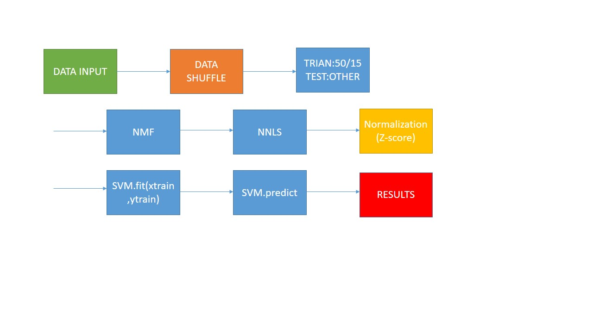
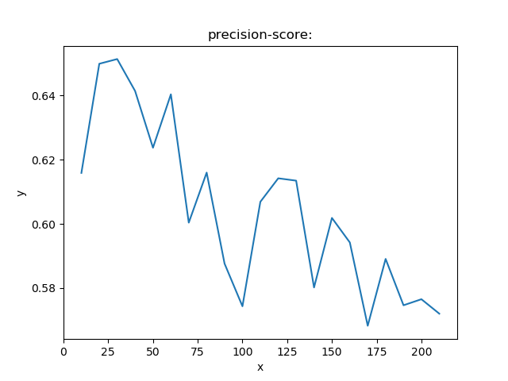
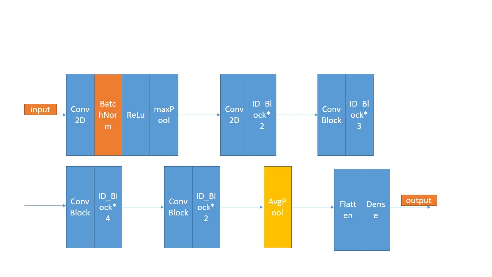

# HSI_svm_pca_resNet50
use SVM  and PCA_ResNet50 to classify HSI
- stage1:
    use SVM to classify HSI(Hyperspectral Image). opertion : Firstly , transfer 3D data to 2D data , and the origial groundtruth data is 2D data , I transfer it to 1D data. Then, according the quantity of GT(groundTruth) ,  I choose 15 vectors from the first three least and choose 50 vectors from the other vectors. Treat these data as training data.the left data is test data. And I use the NMF as the method of demension reduction . Before NMF , I normalize the data using Z-Score. Then i use NNLS on the W matrix AFTER NMF and get H matrix. Finally i use SVM to fit and predict the label.  This is the [NNLS](https://docs.scipy.org/doc/scipy/reference/generated/scipy.optimize.nnls.html). 
    
    here is the process and result:
    
       
- stage2:
    use PCA and ResNet50 to classify HSI.   Firstly,choose 20% of the data as the training data , the other is the test data.  Use PCA as the method of demension reduction , after I put the data into ResNet50  , finally get  the resut.
    Here is the structure of ResNet50 .   The result: loss:. accuary:    

    Reference:
    [PCA](https://blog.csdn.net/program_developer/article/details/80632779)
    [ResNet50_on_Keras](https://blog.csdn.net/u013733326/article/details/80250818)
    [HybridSN](https://github.com/gokriznastic/HybridSN)
    

